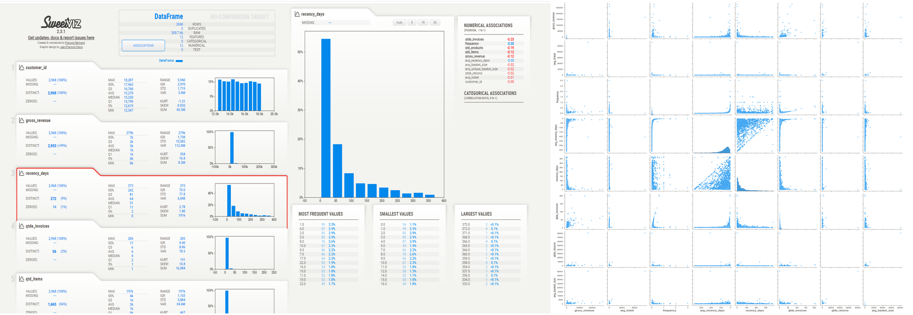
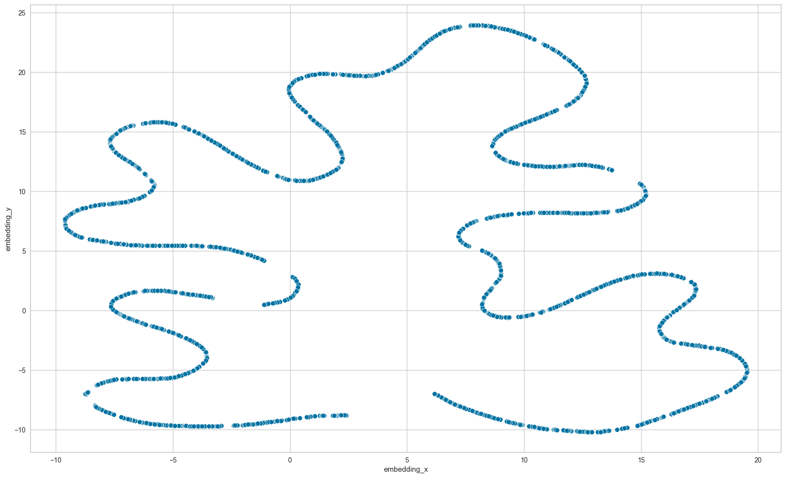
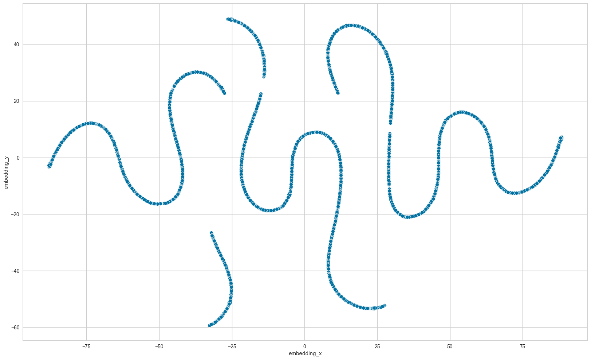
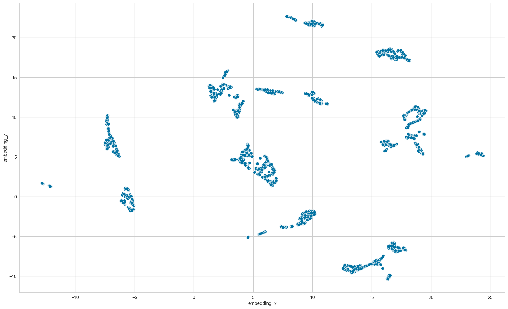
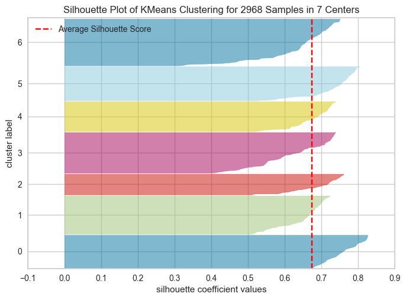
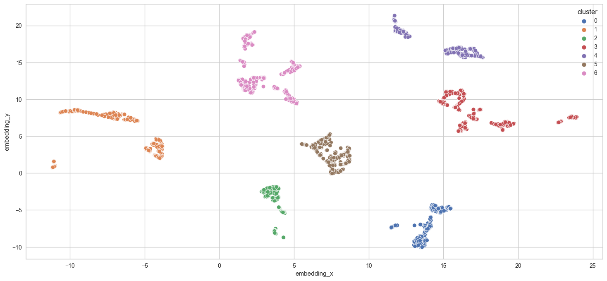
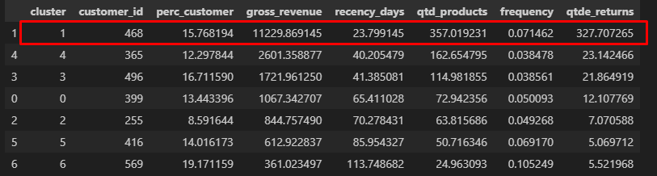

<h2> 1.0. Introdução ao problema de negócio </h2>

A Best Purchase trabalha com o modelo de negócio e-commerce, vendendo produtos de diversas empresas e segmentos diferentes. A equipe de Marketing em pouco mais de um ano de operação percebeu que haviam clientes que compravam produtos mais caros com alta frequencia, contribuindo com uma parcela significativa do faturamento da empresa. Baseado nessas informações a equipe de Marketing vai lançar um programa de fidelidade para os melhores clientes da base, os Insiders. Mas o time não tem um conhecimento avançado em análise de dados para eleger os participantes do programa, por este motivo foi solicitado ao time de dados uma seleção de clientes elegíveis ao programa, usando técnicas avançadas de manipulação de dados.

<h3> 1.1. Questões de negócio </h2>

A empresa Best Purchase gostaria de criar um programa de fidelização de clientes por meio da implementação de um projeto de clusterização. O objetivo é identificar grupos homogêneos de clientes com características semelhantes, possibilitando uma abordagem personalizada para cada segmento. Essa abordagem irá permitir a otimização de recursos, benefícios e aumento da lucratividade da empresa. Como resultado deste projeto, é esperado que seja entregue uma lista de pessoas elegíveis a participar do programa Insiders.

<h3> 1.2. Sobre os dados </h2>

<h2> 2.0. Planejamento da Solução </h2>

Iremos utilizar o método CRISP-DS ao longo do projeto, seguindo todas as suas etapas e visando uma primeira entrega mais rápida porem mantendo uma boa qualidade, posteriormente poderemos voltar para o inicio do ciclo novamente afim de implementar novas tecnicas e melhorias no projeto caso o resultado final ainda não esteja satisfatório.

<h3> 2.1. Data Description: </h3>

* Colunas renomeadas para um padrão
* Verificação da dimensão do conjunto de dados
* Verificado também o tipo de dado de cada coluna
* Verificado se o conjunto de dados tem dados faltantes ou não

<h3> 2.2. Limpeza/Filtragem de dados: </h3>

Com base na EDA e com um pouco mais de informações neste ponto, foi possível adotar uma premissa para realizar a limpeza dos dados, fazendo o preenchimento dos dados que estavam faltantes.

Na filtragem de dados optamos por duas ações para lapidar um pouco mais as informações que deixariamos no dataset para seguir para os próximos passos, foram:

* Vendas com preço unitário > 0 
* Filtrado Stock Code onde foram removidos stock codes categoricos, como por exemplo 'D', 'M', 'DOT', 'CRUK'.

<h3> 2.3. EDA - Analise Exploratoria de Dados: </h3>

Realizado a analise univariada dos dados através do Sweetviz, onde foi gerado um relatório contendo as principais estatisticas de cada váriavel do conjunto de dados e sua distribuição. 

Feito também uma analise bivariada para entender melhor o comportamento das variáveis se comparadas umas com as outras.

<h1 align="left">  </h1>

<h3> 2.4. Redução de dimensionalidade: </h3>

**2.4.1 UMAP:** 
O UMAP é uma técnica de aprendizado de máquina poderosa para reduzir dados de alta dimensão para um espaço de dimensão inferior, enquanto preserva a estrutura topológica dos dados. Ele usa uma estrutura topológica difusa para identificar a variedade subjacente dos dados e projetá-la em um espaço de dimensão inferior.

Uma grande vantagem do UMAP é sua capacidade de lidar com relacionamentos altamente não lineares nos dados, tornando-o útil para visualização e agrupamento, onde técnicas tradicionais como PCA podem falhar.

<h1 align="left">  </h1>

**2.4.2 t-SNE:**
O t-SNE é uma técnica de redução de dimensionalidade que mapeia dados de alta dimensão para um espaço de menor dimensão, preservando a estrutura de similaridade entre os pontos. Ele é usado principalmente para visualização de dados complexos em um espaço mais simples, onde pontos semelhantes são representados próximos e pontos diferentes estão distantes. Isso é alcançado minimizando a discrepância entre distribuições de probabilidade de vizinhança nos espaços de alta e baixa dimensão.

<h1 align="left">  </h1>

**2.4.3 Tree Based Embedding:**
A redução de dimensionalidade usando algoritmos baseados em árvore é uma abordagem que utiliza estruturas de árvore para reduzir a quantidade de características em um conjunto de dados de alta dimensão. Isso pode ser feito por meio da decomposição do conjunto de dados em subespaços menores ou aprendendo uma representação de baixa dimensão com base nas relações entre os pontos. Esses algoritmos são eficientes computacionalmente e, em alguns casos, oferecem interpretabilidade e robustez. No entanto, eles podem não capturar efetivamente estruturas complexas e não lineares. A escolha do algoritmo depende das características específicas dos dados e dos objetivos da análise.

<h1 align="left">  </h1>

<h3> 2.5. Hyperparameter Fine Tunning: </h3>

Escolher a quantidade de clusters para o modelo não é uma tarefa fácil, muitos modelos de machine learning como o KMeans pedem que seja inputado a quantidade de clusters para o treinamento do modelo, e para descobrir isso iremos usar alguns modelos e técnicas para descobrir qual é a quantidade ideal de clusters para uma máxima performance. Foi realizado então o treinamento dos modelos Kmeans, Gaussian Mixture Model, Hierarchical Clustering e DBScan, onde a melhor performance ficou com o KMeans com score de 0.673567

**Silhouette Score Kmeans**
<h1 align="left">  </h1>

**Clusters no espaço**
<h1 align="left">  </h1>

<h3> 2.6. Convert Model Performance to Business Values: </h3>
   
- Numero de customers que vão participar do Insiders: 468
- Faturamento Médio: $11,229.87
- Recência média: 23 dias
- Média de produtos comprados: 357 produtos

<h1 align="left">  </h1>